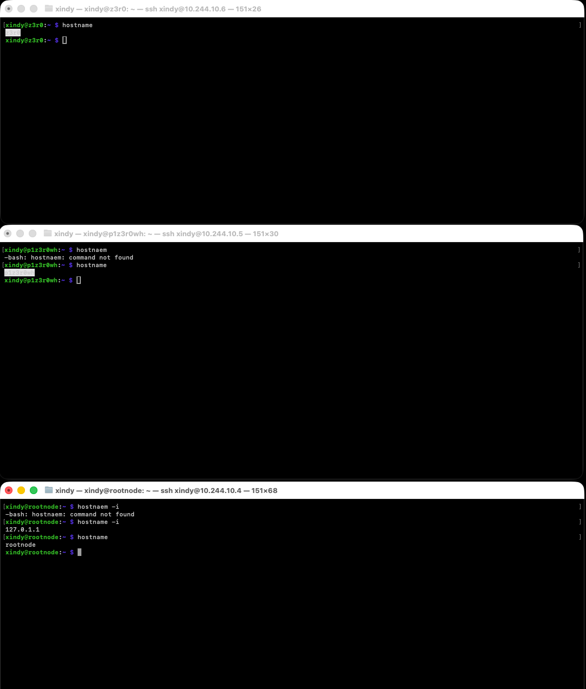
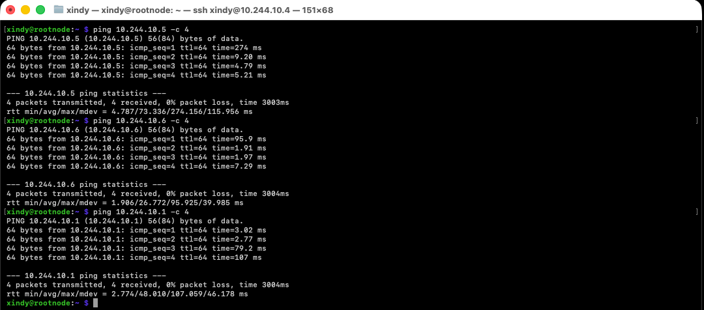
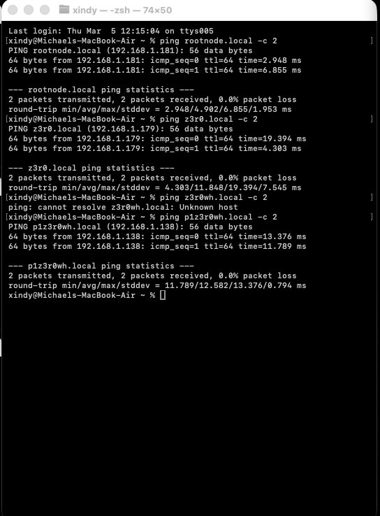
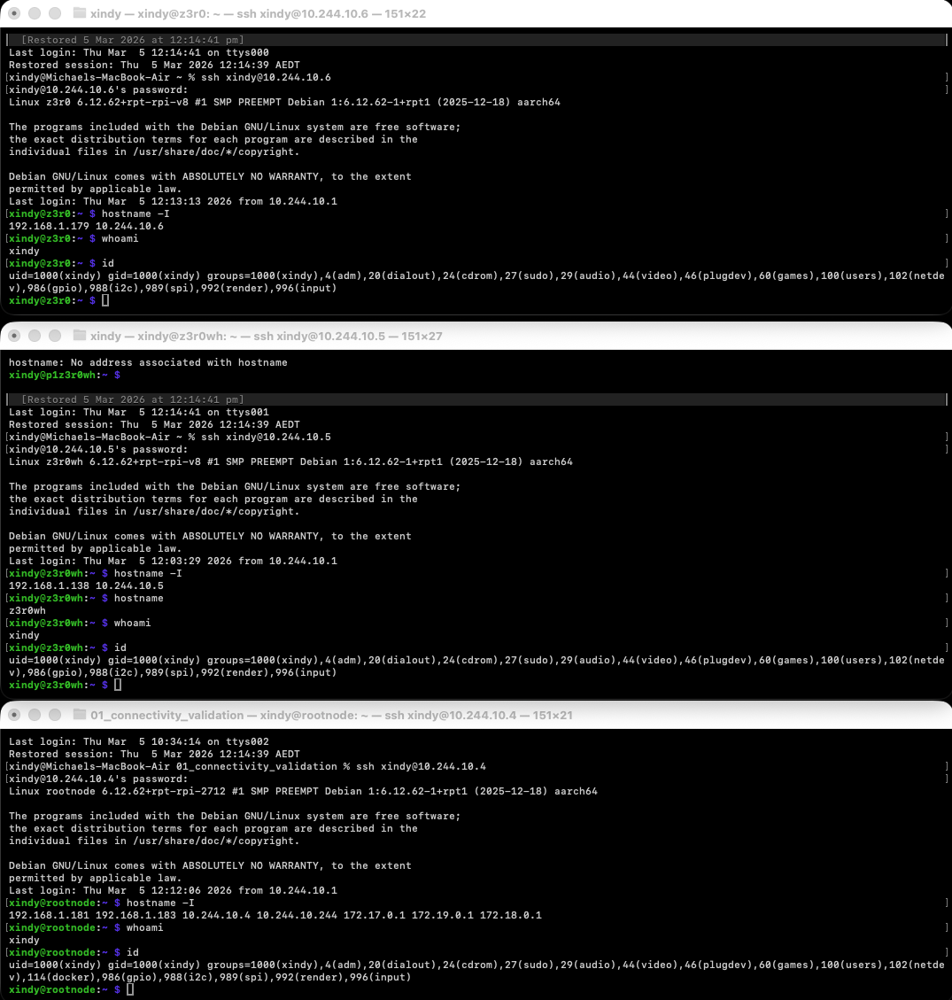

Connectivity Validation

Date: 2026-03-05

Purpose
Make all devices conectable outside of lan adn Verify that all nodes in the lab can communicate over the ZeroTier virtual network after the initial hardware build and network setup

Nodes tested
- Pi 5 (rootnode)
- Pi Zero2W (z3r0)
- Pi Zero (p1z3r0wh)
- Mac (management machine)

Test method

ICMP connectivity test was performed using the ping command on Headless Pi5

Commands used + results 

Observations

All nodes responded successfully with no packet loss.
Latency varies depending on node but remains within expected limits for a ZeroTier network

mDNS Test
Tried to see whetre mac will be bale reach them on local network only without DNS server 
Commands used + results

Identity verifications on each node 
Commands used + results

