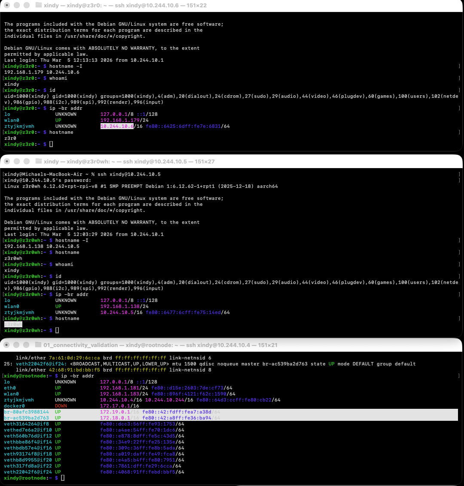

Ip adresses assigned 

Pi5 
Hostname - rootnode
Lan IP - 192.168.1.183
Ethernet IP - 192.168.1.181
ZeroTier Ip - 10.244.10.4 / 10.244.10.244
(see on screenshot bellow that br are Docker bridge networks)
Pi zero2WH
Hostname - z3r0wh
Lan IP - 192.168.1.138
ZeroTier Ip - 10.244.10.5

Pi zero2W
Hostname - z3r0
Lan IP - 192.168.1.179
ZeroTier Ip - 10.244.10.6

VPN IPs 
Pleae note teh ZT VPN adresses are assign in order from 
10.244.10.4 to 6 base on device 
- Obviosuly even 1 to 3 are assigned but those one are private 
- Personal prefrence is to have them assigned base on age

Command used:

- I Used command: ip -br addr
- As that is the most human like readable form where you can also see whetre the Ip is Lan,eth or vpn

Connectivioty between device 
- was tested perviously, no need to include it here
- 
